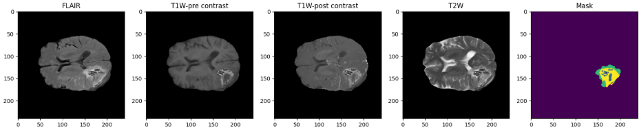
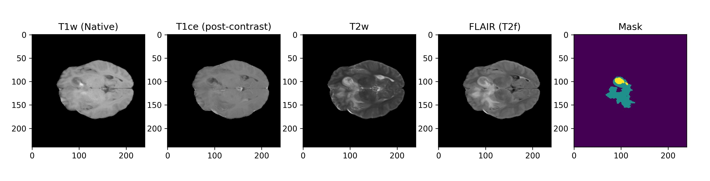
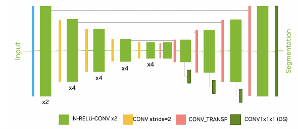
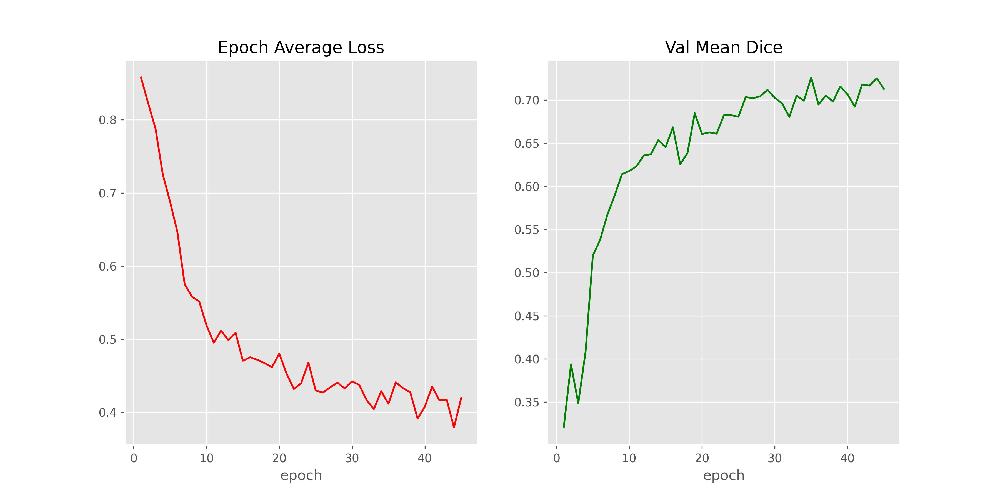
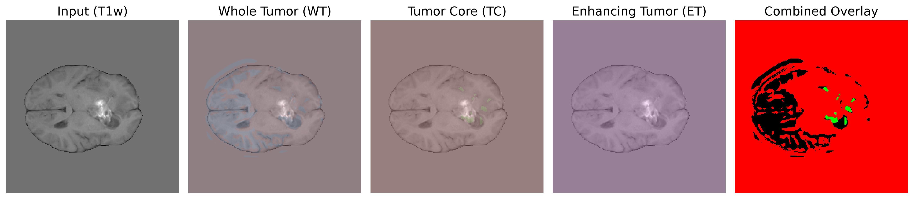

# Post-Treatment Brain Tumor Segmentation using MONAI SegResNet Model
The primary objective of **Goal of brain tumor segmentation** is to **accurately delineate (i.e. outline or label pixel-wise)** tumor regions within brain imaging data such as MR Images.  This is typically achieved using convolutional neural networks (CNN) with an encoder - decoder architecture.  The model processes multi-modal MR data, mapping voxel intensities from four standard imaging sequences:
- **FLAIR** (Fluid-Attenuated Inversion Recovery)
- **T1-weighted pre-contrast** (T1w)
- **T1-weighted post-contrast** (T1ce, reflecting enhancing tumor tissue)
- **T2-weighted** (T2w)

## Author
**William (Wiley) Winters** Masters of Data Science [wwinters@regis.edu](mailto:wwinters@regis.edu)
## Project Overview
Despite a wealth of research on detecting brain tumors using MR Images, there is a notable gap in the literature on assessing the effectiveness of treatment through post-treatment imaging. Current studies primarily focus on tumor detection where MR Images clearly distinguish between healthy and tumorous tissue. Using these images, a Convolutional neural network (CNN) can be used to effectively classify them as tumor-positive or negative. However, post-treatment imaging presents a challenge due to the murkiness of tumor cavities caused by edema, necrotic tissue, and disrupted blood-brain barriers. CNNs trained on well-defined tumor images often perform poorly on post-treatment images, leading to incorrect classifications. The main issue with CNN classification is that it does not distinguish between the different types of tissue displayed in an MR Image. A better solution is to apply segmentation to the post-treatment image since it does label the different tissue types identified in the image. One of the key advantages of segmentation is the ability to delineate tumors into specific areas such as necrotic core (NCR), enhancing tumor (ET), and peritumoral edema (ED).

The limitation of using CNN trained on pre-operative brain tumor imaging highlights the need for an alternative approach.  Further research suggests that image segmentation could be a viable solution, enabling the mapping and color-coding of different tissue types within the resection cavity.  This project aims to train a SegResNet model on BraTS-style brain tumor volumes, then use the model to preform segmentation on MR Images from a post-treatment glioma brain tumor dataset.  The following sequence of images are of a post-treatment glioma patient and normal tissue, blood-brain barrier (BBB), tumor core, and edema are clearly identified.  TC has been identified and highlighted with a red box.

## Model Selection
Many modern segmentation models used in international competitions such as **Brain Tumor Segmentation (BraTS)** challenge and the **Medical Segmentation Decathlon (MSD)** are based on the U-Net architecture.  The model selected for this study is from MONAI (Medical Open Network for AI) called 3D-SegResNet.  MONAI's models are part of the PyTorch/Lightning ecosystem and are trained and used like any other PyTorch model.  SegResNet was selected for the following reasons
- It is a residual encoder/decoder CNN designed specifically for 2D/3D medical segmentation
- Uses less GPU resources than a transformer-style model making it a good fit for training with consumer grade GPUs
- Is a top performer in challenges like BraTS

## Model Training
Training was accomplished using a standard PyTorch training function with a customer early stopping callback.  After around 27 epochs the callback halted the training cycle and the best weights were saved for later use.  Main measures for segmentation training are *Validation Average Loss* and *validation mean Dice score*.

## Inference Results
A representative image was selected at random from a post-treatment glioma patient dataset sourced from The Cancer Imaging Archive (TCIA). Semantic segmentation was performed on this image using the model’s best-performing training weights. The ground truth segmentation—manually delineated and provided as a NIfTI file within the dataset—was used to evaluate the model’s output. The Dice Similarity Coefficient (DSC) was computed between the model’s predicted segmentation and the ground truth mask. Summary metrics, including the DSC, are listed in the table below.
| **METRIC**         | **VALUE** |
|--------------------|-----------|
| Mean Dice Score    | 0.49      |
| TC mean Dice score | 0.61      |
| WT mean Dice score | 0.73      |
| ET mean Dice Score | 0.12      |

Below is the predicted regions overlayed over the base T1w image

## Conclusions
Performing segmentation on post-treatment MR Images can aid in identifying healthy brain tissue, core tumor residue, abnormalities to the blood-train barrier (BBB) and edema.

## Contact
For questions or inquiries, please contact **Wiley Winters** at [wwinters@regis.edu](mailto:wwinters@regis.edu).